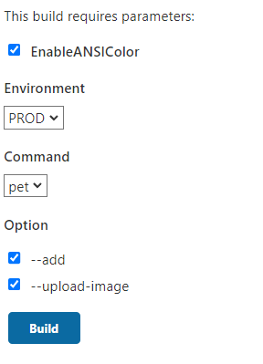

# Проект по тестированию API https://petstore.swagger.io/

## Цели

- самостоятельно с нуля написать тестовый проект
- покопаться в реализации JUnit 5, научится внедрять/переопределять поведение
- так же дополнительно поработать с технологиями:
  - Maven
  - Jenkins
  - Docker (пока не реализовано)
  - RestAssured (очень распространен, раньше не пользовался. По моему, мнению не самый лучший вариант)
  - Кодогенерация (делал, но пока не удовлетворяет запросы, нужно что-то придумывать)

## Реализовано

- Клиент на RestAssured
- Модели самописные на Lombok
- Свои аннотации Test и TestClass
- Инициализация конфигурации перед запуском и в jar файле
- Executable jar c запуском через Tag и Tag expression
- Jenkinsfile

## Хотелось бы реализовать

- Логирование
  - в отдельные файлы каждый тест
  - переопределить принт логирование на более классический (если это возможно малой кровью)
  - возможно добавить еще инфо о тесте
- запуск контейнера в Docker
- Формирование Allure отчета
- Качественно проработать генерацию по swagger
- Разобраться с параллельным запуском

## Запуск

- выкачать проект
- mvn clean package
- в терминале указать
  `java -jar .\target\Launcher.jar -e PROD pet -ui`
  или
  `java -jar .\target\Launcher.jar -e PROD all`

Вызов команды  `java -jar .\target\Launcher.jar -h` выглядит следующим образом :

```
Usage: Test App [options] [command] [command options]
  Options:
    -e, --environment
      Test environment.
      Default: PROD
      Possible Values: [DEV, TEST, PROD]
    -h, --help
      Print usage.
  Commands:
    pet      Pet controller tests
      Usage: pet [options]
        Options:
          -a, --add
            Add pet endpoint tests
            Default: false
          -ui, --upload-image
            Upload Image endpoint tests
            Default: false

    all      Run all project
      Usage: all [options]
        Options:
          -r, --run
            Default: false

```

## Jenkins

- К плагинам устанавливаемых по дефолту, установлены:
  - AnsiColor
  - Active Choices Plug-in
- Передача параметров при запуске jar файла:




